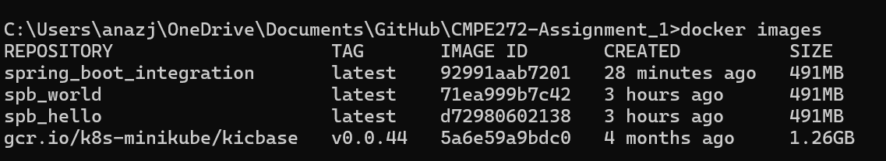
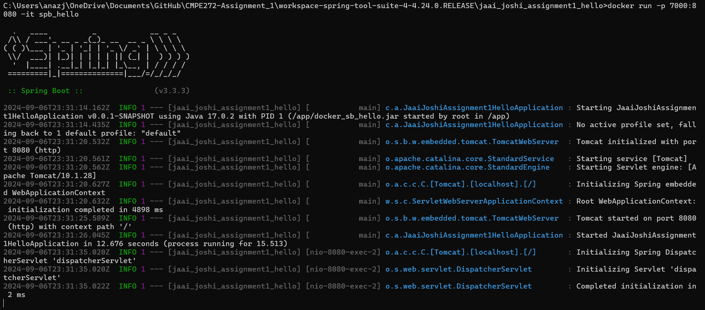
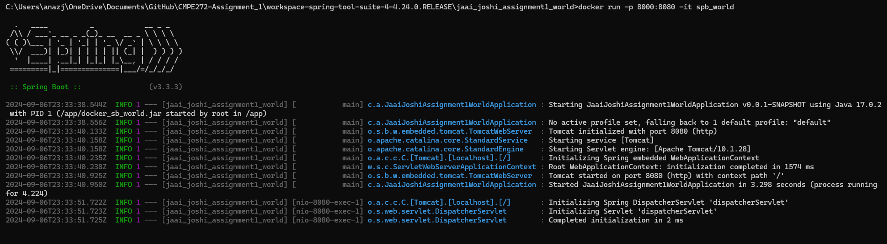
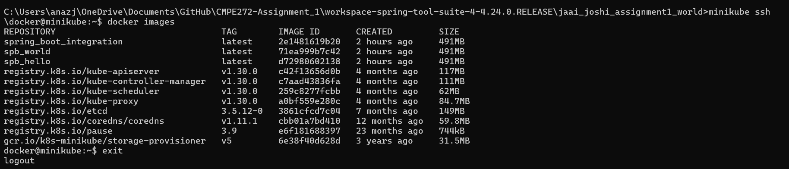
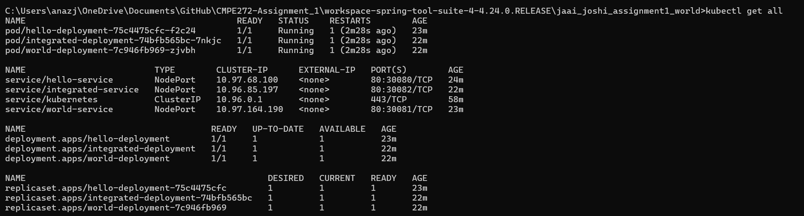
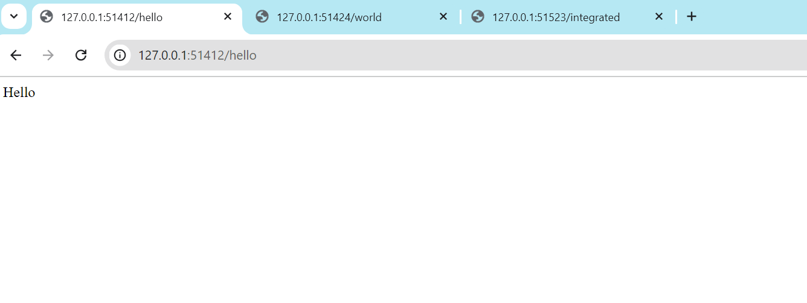
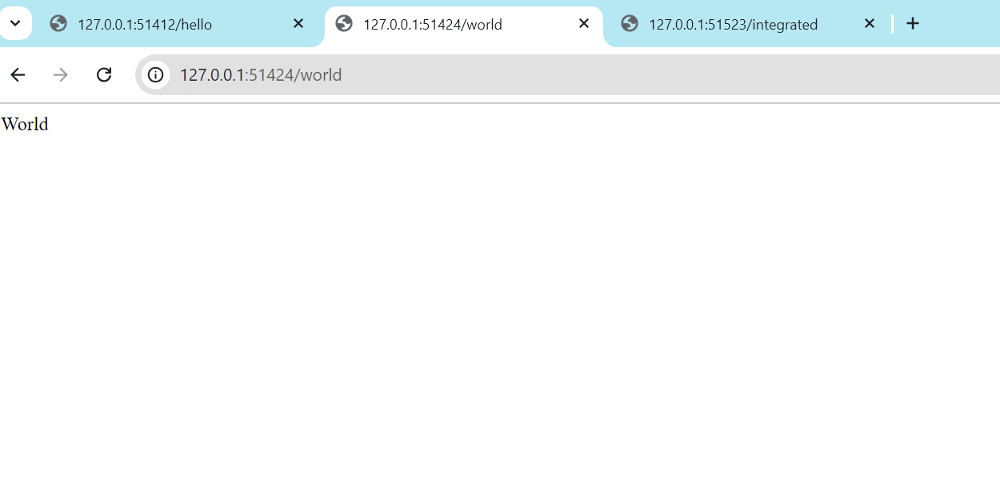
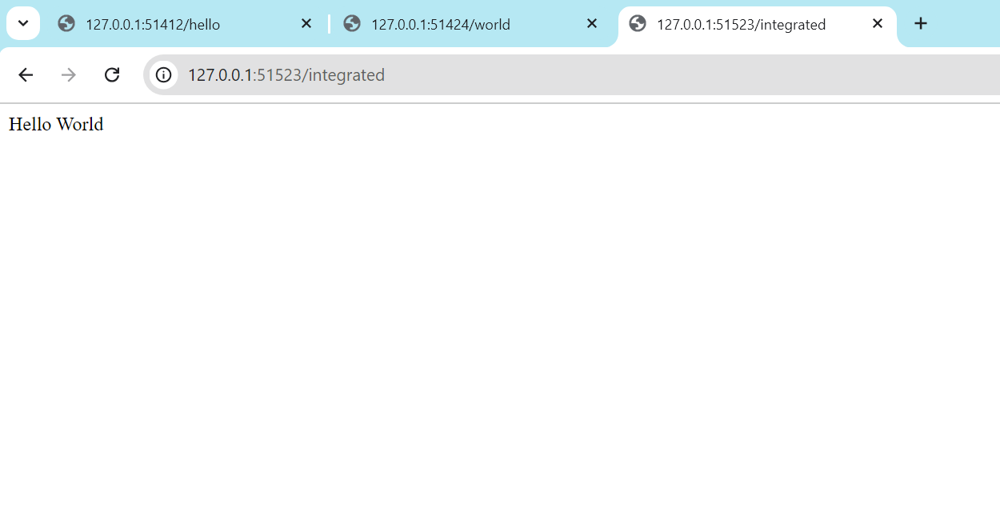

# CMPE272-Assignment_1
CMPE272 assignment1

1. Create 3 different springboot projects through Spring Tool Suite.
2. Create an endpoint called "/hello" in the 1st project, "/world" in the 2nd project and "/integrated" in the 3rd project.
3. Convert the given java files to their corresponding .jar files by clicking on the project and selecting 'Run as Maven install'.
4. Create separate dockerfiles for these 3 projects.
5. Include these newly created .jar files in the dockerfiles.
6. Build 3 separate docker images for these 3 projects using: 'docker build -t spb_hello .' , 'docker build -t spb_world .' , 'docker build -t spring_boot_integration .'
7. The newly built docker images can be viewed using 'docker images' command. It will look like this:

8. Once the images are built, try to run those newly built images using the command: 'docker run -p 7000:8080 -it spb_hello' and 'docker run -p 8000:8080 -it spb_world. Once this command runs, by going on the browser we need to type: 'localhost://7000/hello', 'localhost://8000/world'.

9. Install Minikube and Kubectl.
10. Create a minikube cluster by using the command: 'minikube start --driver=docker'.
11. Create and define services and deployment manifest files for these three microservices.
12. Define the port, target port and the nodeport in the services files.
13. In order to include the local docker images in the minikube cluster, we will need to load these images using the command: 'docker image load imagename'. In this way, the docker images would be loaded inside the minikube cluster.
 
14. In the terminal, execute a command: kubectl apply -f "hello_deployment_manifest.yml". And similarly, apply it for the hello_service_manifest.yml, world_deployment_manifest.yml and world_service_manifest.yml, and integrated_service_manifest.yml.
15. Using the command: 'kubectl get all', we will get the newly created pods along with their status.

16. Now using the command: 'minikube service servicename --url', we will get an ip address where we can access the application. We will need to give the corresponding endpoint after this url such as "/hello", "/world", "/integrated".

[Dockerhub links to the repositories](https://hub.docker.com/repositories/jaaij)

